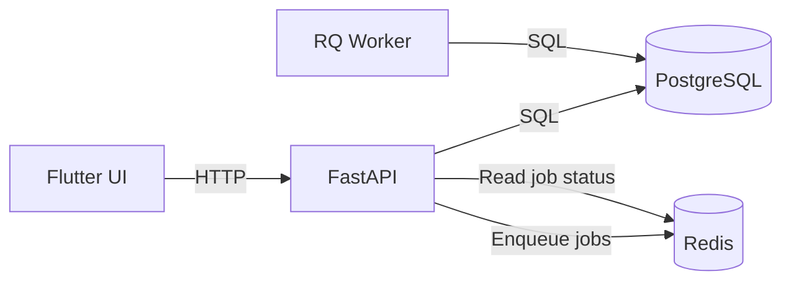
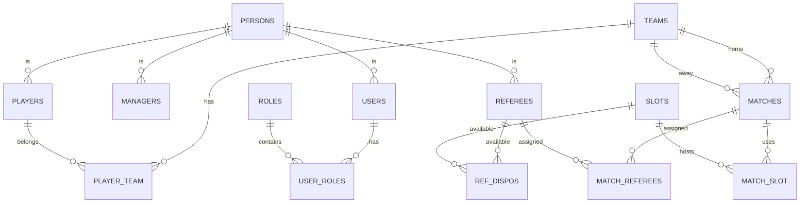

# Architecture & Data

## Architecture overview

Components:
- Flutter frontend (web)
- FastAPI backend (REST API)
- PostgreSQL database (core data)
- Redis + RQ worker (background jobs)
- Flyway migrations (schema management)

Data flow (high level):

## ERD + schema

ERD source:
- documents/DB_leagues_diagram_latest.pdf

Schema lives in migrations:
- db/migrations/V1__init.sql
- db/migrations/V2__seed_admin.sql

Key entities:
- persons, users, roles, user_roles
- teams, player_team, matches, match_slot
- goals, cards, substitutions
- referees, ref_dispos, match_referees
- ranking, notifications, subscriptions

ERD (core subset):

## Key constraints and indexes

Constraints (examples):
- `teams` unique (division, name)
- `matches` check: home_team_id <> away_team_id
- `match_slot` primary key (slot_id, match_id)
- `match_referees` primary key (match_id, referee_id)
- `user_roles` primary key (user_id, role_id)

Indexes (from V1__init.sql):
- `matches(home_team_id)`, `matches(away_team_id)` for team lookup
- `matches(division, status)` for schedules and filters
- `goals(match_id)`, `cards(match_id)`, `substitutions(match_id)` for event queries
- `lineups(player_id, match_id)` to detect conflicts
- subscription/favorites indexes for fan features

## Representative SQL queries

See `documents/sql/` for 9 sample queries with notes and sample outputs.
